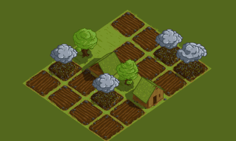

# Some of the projects I worked on in the past

## 2017 - Four Seasons

## 2015 - Vision Timetable
During the software project course at the University of Bremen, five fellow students of mine and I built a tool to create and manage timetables for a primary school located in Bremen. Due to the internal structure of the school, the program needed to handle some minor and major cases, most available timetable tools do not support out of the box, e.g. support for different disjunct time resources. The Vision Timetable is written in Java.  
